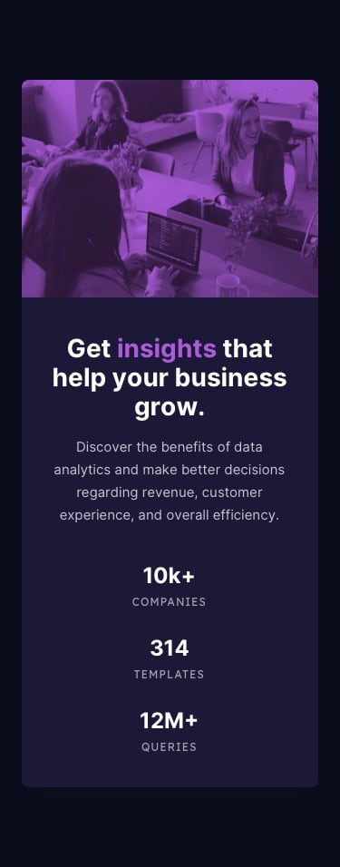

# TechCrush Frontend Bootcamp — Assignment 3

## Stats Preview Card

A responsive statistics preview card built with HTML and CSS as part of the TechCrush Frontend Development Bootcamp.

The project recreates the provided desktop and mobile designs while applying CSS Grid, Flexbox, responsive media queries, positioning, image overlays, and custom typography.

## 🎯 Assignment Objective

The goal of this assignment was to translate a provided UI design into a responsive webpage while applying concepts covered in class, particularly:

- CSS Grid
- CSS Flexbox
- Responsive design
- Media queries
- Positioning
- Image overlays
- CSS custom properties
- Typography and font pairing

## 🖥️ Design

The implementation follows the provided desktop and mobile designs.

### 💻 My Implementation


### Desktop Reference


### Mobile Reference



## 🛠️ Technologies Used

- HTML5
- CSS3
- CSS Grid
- CSS Flexbox
- Responsive Media Queries
- Google Fonts

### Fonts

- Inter
- Lexend Deca

## ✨ Key Features

- Responsive desktop and mobile layouts
- Two-column CSS Grid layout on desktop
- Single-column layout on mobile
- Flexbox-based statistics section
- Responsive image handling with `object-fit`
- Purple image overlay using a pseudo-element
- CSS custom properties for consistent colors
- Semantic HTML structure
- Responsive typography
- Mobile-first considerations for smaller screens

## 📂 Project Structure

```text
Assignment/
├── css/
│   └── styles.css
├── design/
│   ├── desktop-design.jpg
│   └── mobile-design.jpg
├── images/
│   ├── favicon-32x32.png
│   ├── image-header-desktop.jpg
│   └── image-header-mobile.jpg
├── index.html
├── preview.jpg
└── style-guide.md
```

---

## 🧠 What I Learned

This assignment helped me understand that CSS layout is less about memorizing properties and more about understanding **which element should be responsible for a particular layout decision**.

### 🧩 CSS Grid

I used **CSS Grid** to divide the card into two equal sections on desktop:

* **Content**
* **Image**

On smaller screens, the grid transitions into a single-column layout, allowing the content and image to stack naturally.

### ↔️ Flexbox

I used **Flexbox** for the statistics section.

On desktop, the statistics are arranged horizontally:

```text
10K+     314     12M+
```

On mobile, they switch to a vertical arrangement to better fit the narrower viewport.

### 📱 Responsive Design

I used **CSS media queries** to adapt the layout to smaller screens.

The desktop two-column card becomes a single-column layout on mobile, while the statistics transition from a row to a column.

This reinforced the idea that responsive design isn't simply about making elements smaller — it's about **changing the layout to suit the available space**.

### 🎨 Image Overlay

The purple tint over the image was created using a **CSS pseudo-element** and positioning rather than modifying the original image.

This allowed the image and overlay to remain separate while giving the final design the same visual effect as the reference.

### 🎯 CSS Custom Properties

I used **CSS custom properties (variables)** to store the colors provided in the design guide.

For example:

```css
:root {
    --navy-950: hsl(233, 47%, 7%);
    --blue-950: hsl(244, 38%, 16%);
    --purple-500: hsl(277, 64%, 61%);
}
```

This made the stylesheet easier to maintain and helped keep the implementation consistent with the provided design system.

---

## 📐 Responsive Design

The implementation was designed around the provided reference dimensions:

| Viewport    |    Width |
| ----------- | -------: |
| 📱 Mobile   |  `375px` |
| 🖥️ Desktop | `1440px` |

The layout also remains responsive across intermediate viewport sizes rather than being restricted to the two reference dimensions.

### Desktop

* Two-column CSS Grid
* Content and image displayed side-by-side
* Statistics arranged horizontally

### Mobile

* Single-column CSS Grid
* Image positioned above the content
* Statistics arranged vertically
* Content spacing and alignment adjusted for the smaller viewport

---

## 🏆 Tutor Feedback

> **"Outstanding submission! You have exceeded expectations and demonstrated a deep understanding of the material."**

### Score: **5/5** ⭐

---

## 👤 Author

**Brian Ngari Wambui**

TechCrush Frontend Development Bootcamp

**Focus:** HTML • CSS • Responsive Design • CSS Grid • Flexbox
